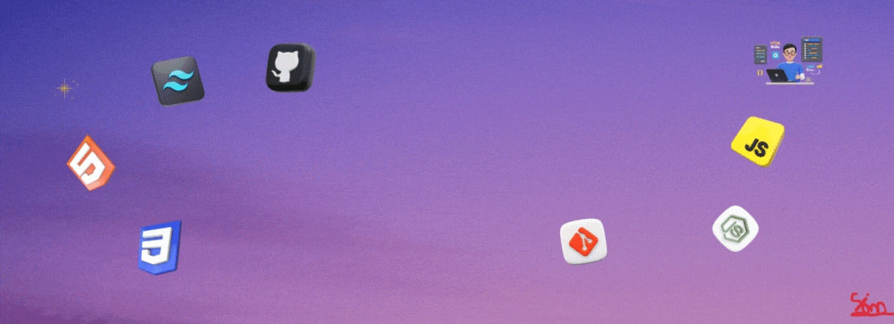

<h1 style="color:#ff2b2b; font-style: italic;">
  
  Hi, I'm MD. Siam Sheikh
</h1>

Welcome to my GitHub profile!

  

><h2 style="color:#ff2b2b; font-style: italic;">🚀About Me</h2>  
I’m a Front-End Web Developer passionate about creating engaging, user-friendly digital experiences. I love learning new technologies and sharing my knowledge with others whenever possible. Problem-solving excites me, and I enjoy tackling real-world challenges with creativity and strategy.I’m goal-oriented, always working with a clear vision in mind to deliver impactful results. My key focus areas include React.js and JavaScript, and I’m continuously expanding my skills to stay ahead in the ever-evolving tech world. 
I believe in positivity, growth, and collaboration — because great things are built when people share ideas and work together.

><h2 style="color:#ff2b2b; font-style: italic;">👨‍💻Skills</h2>   
 

 

><h2 style="color:#ff2b2b; font-style: italic;">🛠️Tools & Platforms</h2>  
 

 

 

 

><h2 style="color:#ff2b2b; font-style: italic;">📫 How to Reach Me</h2> 
 
[]
 

><h2 style="color:#ff2b2b; font-style: italic;">✅ Fun Facts</h2>  
`♟️ I enjoy playing Chess`  
`💻 I enjoy coding and creating new projects` 
`🌟 I like to learn and explore something new every day` 
  

---
***🚀 Always curious, always learning, and ready for new challenges!***

